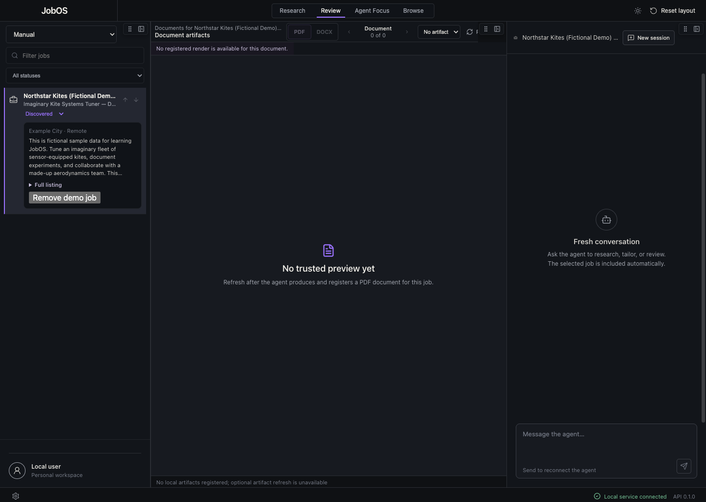
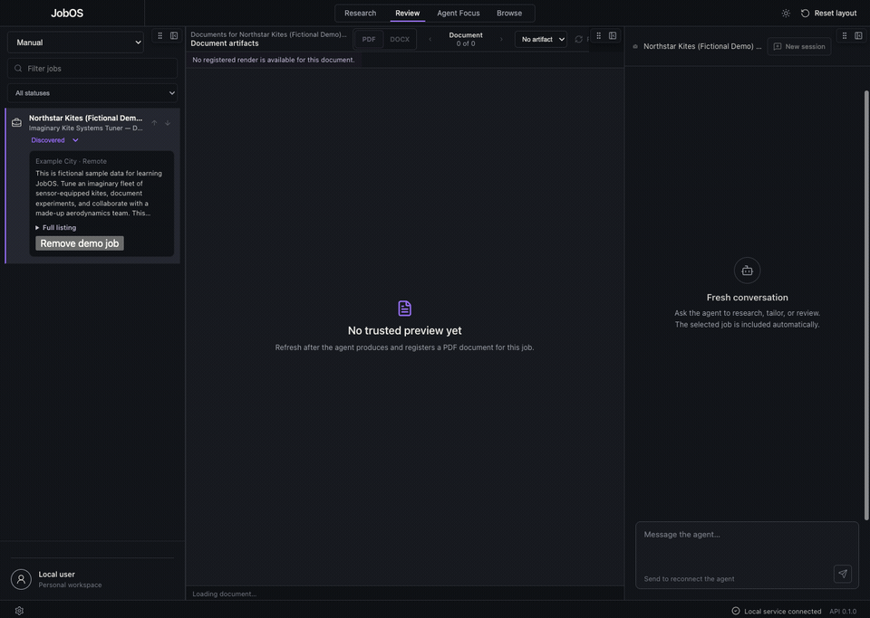

# JobOS

Job searching is usually split across job boards, browser tabs, spreadsheets,
AI chats, resumes, and cover letters. Each switch makes context easier to lose.

**JobOS is an open-source, local-first desktop workspace that keeps job
discovery, a persistent browser, document editing, and human-agent collaboration
together in one place.**

## Why JobOS exists

AI agents can research companies, compare opportunities, and help tailor an
application. But a chat window alone is a poor place to manage a months-long job
search: the person cannot easily see what the agent sees, inspect what changed,
or return to the same working context later.

JobOS turns that disconnected process into a shared workbench. Jobs, live web
pages, documents, conversation, and agent activity stay visible and connected,
so the user can guide the work, review the real result, and remain in control.

## An example journey

In a configured JobOS workspace, a user can:

1. Use the built-in browser to sign in to job sites, search for roles, and keep
   those sessions and tabs available between visits.
2. Find a promising listing and save it to the JobOS workspace without leaving
   the browser.
3. Ask a connected agent to inspect the listing and tailor a resume or cover
   letter for the role.
4. Watch the agent's activity, review the real document beside the listing, and
   make small adjustments in the built-in DOCX editor.
5. Export the approved DOCX/PDF to the computer.
6. Return to the same browser session, complete the application, upload the
   tailored file, and submit it manually—all without leaving JobOS.
7. Reopen JobOS later with the jobs, tabs, documents, conversation, and layout
   still where they left them.

The agent is optional. Local job tracking, browsing, and document work remain
usable when no compatible agent runtime is configured.

## See JobOS in action



The preview uses only fictional starter data and a checksum-pinned `(FAKE)` DOCX
fixture. Optional agent and artifact-refresh integrations remain unavailable
unless explicitly configured.

<details>
<summary>Watch the 10-second synthetic walkthrough</summary>



</details>

Static equivalents: [Browse list and fictional job detail](docs/media/screenshots/jobos-browse-detail-1440x1024.png) · [Saved retained-OOXML editor with fake document](docs/media/screenshots/jobos-ooxml-editor-saved-1440x1024.png) · [capture provenance and privacy checks](docs/media/README.md)

## What makes JobOS different

- **One continuous application workflow:** search in a persistent browser, save
  the role, tailor and edit the documents, then return to the listing to apply
  without moving between disconnected tools.
- **Human and agent share the same state:** both work with the same jobs,
  browser context, documents, and history rather than parallel copies.
- **The user stays in control:** agent activity is visible, consequential actions
  can require approval, and JobOS does not automatically submit applications.
- **Local-first and private by default:** the public setup uses local storage and
  loopback services without requiring a hosted backend or private network.
- **Built for continuity:** selected jobs, browser tabs, document state,
  conversation, and workspace layout survive restarts.

> [!IMPORTANT]
> JobOS is open-source, pre-release alpha software. The source-first clean-clone
> path is accepted, including local initialization and synthetic demo data, but
> there is no supported public binary yet. It currently runs from source on
> macOS. See the [release process](docs/public/release-process.md).

## Current alpha status

- **Maturity:** pre-release alpha; interfaces and storage may change.
- **Distribution:** source-first. There is no supported public JobOS binary yet.
- **Desktop:** macOS is the current desktop target. Linux runs backend and source
  quality checks in CI. Windows is not currently supported.
- **Privacy:** local-first public defaults run without a private network, private
  data, or a second repository; integrations remain explicit and optional.

<details>
<summary>View the current source capabilities and public-alpha targets</summary>

| Capability | Current source status | Public-alpha target |
|---|---|---|
| Desktop workbench | Runs from source on macOS with accepted clean first-run initialization | Installed-app distribution remains a separate gate |
| Jobs and history | Built-in mutable SQLite repository with labeled synthetic demo data; private installs may explicitly select JobHunter | Public distribution review |
| Browser workspace | Electron-owned local capability | Local capability with truthful unavailable states |
| Documents | SQLite/local mode supports editable create, save, snapshots, DOCX import, paired DOCX/PDF publish, restart, and download; JobHunter render/refresh remain optional | Installed-app acceptance with representative DOCX files |
| Embedded chat agent | Offline/not-configured in the public source defaults; existing private deployments can connect a compatible runtime | Remains optional |
| External agent through MCP | Authenticated stdio adapter over the local JobOS API; setup journey below | Stable local capability errors |

This table is intentionally conservative. Clean-home source acceptance does not
imply that packaging, signing, notarization, publication, or deployment passed.

</details>

## Run JobOS from source

### Prerequisites

Use the versions pinned by the repository:

- macOS for the desktop application
- Node.js `26.5.0` (`.node-version`)
- pnpm `10.33.1` (`packageManager` in `package.json`)
- Python `3.11` (the workspace requires `>=3.11,<3.12`)
- uv `0.11.18` (the CI-pinned version)
- Xcode Command Line Tools when building native macOS helpers

Clone the repository and install its locked JavaScript and Python workspaces:

```bash
git clone https://github.com/cobibean/job-os.git
cd job-os
npm install --global pnpm@10.33.1
pnpm install --frozen-lockfile
uv sync --all-packages --frozen
```

Launch the source application:

```bash
pnpm dev
```

On the first launch:

1. Select **Set up JobOS**. JobOS creates a private local profile, loopback API,
   SQLite databases, local artifact directory, and two independent local
   credentials.
2. Select **Restart JobOS** when setup completes. If the development command
   exits during restart, run `pnpm dev` again.
3. Keep JobOS open while using it or an MCP-connected agent. The source desktop
   starts and owns the local API process, and live browser tools require the
   desktop connection.

Expected result: the workbench opens with one unmistakably fictional
**Northstar Kites (Fictional Demo)** job and a `(FAKE)` starter resume. The
embedded chat reports that its agent is not configured; that is the truthful
public default.

## For developers

### Connect an external agent through MCP

JobOS exposes a local stdio MCP server for an MCP-capable agent. This lets an
external client operate the shared JobOS jobs, workspace, documents, activity,
and validated browser capabilities. It does **not** power or replace the
embedded JobOS chat, which remains offline in the public source configuration.

Complete the first-run setup above and keep JobOS open. Then add a stdio MCP
server to your agent. MCP clients use different settings files and labels, but
many accept the following `command` and `args` shape:

```json
{
  "mcpServers": {
    "jobos": {
      "command": "/bin/zsh",
      "args": [
        "-c",
        "set -euo pipefail; JOBOS_REPO='/absolute/path/to/job-os'; JOBOS_CONFIG=\"$HOME/Library/Application Support/JobOS/config.json\"; JOBOS_DEVICE_ID=$(/usr/bin/plutil -extract deviceId raw \"$JOBOS_CONFIG\"); export JOBOS_CONFIG_PATH=\"$JOBOS_CONFIG\" JOBOS_DEVICE_ID; export JOBOS_DEVICE_TOKEN=\"$(\"$JOBOS_REPO/apps/desktop/build/jobos-keychain\" get com.cobibean.jobos.device-token \"$JOBOS_DEVICE_ID\")\"; export JOBOS_MCP_TOKEN=\"$(\"$JOBOS_REPO/apps/desktop/build/jobos-keychain\" get com.cobibean.jobos.mcp-token \"$JOBOS_DEVICE_ID\")\"; exec \"$JOBOS_REPO/.venv/bin/jobos-mcp\""
      ]
    }
  }
}
```

Replace `/absolute/path/to/job-os` with the absolute path to your clone. This
launcher matches the standard macOS source setup: it reads the generated device
ID from `~/Library/Application Support/JobOS/config.json`, obtains both local
credentials from macOS Keychain at process start, and loads them into the
launcher environment inherited by the MCP server. It does not write credential
values to the repository or the MCP configuration.

The exact outer JSON and the location of your MCP settings are client-specific.
The JobOS server contract itself is:

| Setting | Value |
|---|---|
| Transport | stdio |
| Executable after workspace sync | `/absolute/path/to/job-os/.venv/bin/jobos-mcp` |
| API | `http://127.0.0.1:8766` |
| Required process environment | `JOBOS_DEVICE_TOKEN` and `JOBOS_MCP_TOKEN` |
| Standard macOS credential provider | Keychain, keyed by the generated `deviceId` |

Never print, paste, commit, screenshot, or include either credential in logs or
issues. If your `config.json` does not report `"provider": "keychain"`, the
Keychain launcher above does not match that profile; do not substitute raw
credential values into the example.

Restart or reconnect your MCP client, then use this read-only proof prompt:

> Use the JobOS `job_list` tool. Do not modify anything. Report the company,
> title, and whether the returned job is synthetic.

A fresh profile returns **Northstar Kites (Fictional Demo)**,
**Imaginary Kite Systems Tuner — Demo Role**, and `synthetic_demo: true`. If the
tool is unavailable, first confirm that JobOS is still open, first-run setup
finished, the repository path is absolute, and the MCP process starts from this
clone. See [troubleshooting](docs/public/troubleshooting.md) for the source
runtime checks.

### Contributor verification

The example journey above does not require the complete repository gate. Run
these checks before contributing or when validating an exact source revision:

```bash
pnpm check            # lint, typecheck, test, and build
pnpm contracts:check  # prove generated API contracts are current
```

Expected result: public-tree and fixture checks, lint, generated-contract checks,
TypeScript checks, desktop and Python tests, and the production source build
complete successfully. This source verification does not prove a signed or
notarized public binary.

### Demo data

The first-run interface calls `jobos-init`, which initializes a fresh local
profile with exactly one clearly labeled synthetic demo job and one `(FAKE)`,
fictional, do-not-apply starter resume.
Removing the demo also removes its editable document metadata and is persistent;
JobOS will not silently re-seed either item. `jobos-init --reset-demo
--confirm-reset-demo` is the separate, explicitly confirmed reset path for both.

### Data and privacy

Run `uv run jobos-init` for the default platform data directory, or pass
`--data-dir` for an isolated source/test profile. The generated `config.json`
uses a loopback local service, separate state and jobs SQLite databases, local
artifacts, and an offline agent by default. Runtime files are not source
artifacts and must never be committed.

Before manipulating runtime data, stop JobOS and use diagnostics to open the
active data location. Back up the complete configured profile and verify every
database and artifact directory required by the enabled capabilities. Private
runtime modes may configure additional locations and remain responsible for
backing those up.
Credentials stored in macOS Keychain are not included in file backups and may
need to be configured again after a restore. Uninstalling the app/source does
not intentionally remove the separate runtime data. See
[data and privacy](docs/public/data-privacy.md) for the conservative move-aside
procedure and the future public contract.

### Architecture

JobOS is a pnpm and uv monorepo:

```text
apps/desktop/          Electron + React workbench
packages/contracts/    shared generated API contracts
packages/docx-engine/  retained-OOXML document engine
packages/docx-editor-core/ local document editor core
services/api/          FastAPI application core
services/mcp/          MCP adapter over the API
```

The public architecture keeps the application core local and puts integrations
behind explicit adapters. JobHunter remains a separate private adapter implementation;
public JobOS may define compatible interfaces but must not require or distribute
that private package. Read the [architecture overview](docs/public/architecture.md).

### Package visibility versus source licensing

Workspace packages remain marked `"private": true` to prevent accidental npm
publication. That field controls package-registry publishing only—it does not
make a Git repository private and does not replace the Apache-2.0 license.

### Documentation

- [Architecture](docs/public/architecture.md)
- [Product contract](docs/public/product-contract.md)
- [Agent capability parity](docs/public/capability-parity.md)
- [Data and privacy](docs/public/data-privacy.md)
- [Troubleshooting](docs/public/troubleshooting.md)
- [Release process](docs/public/release-process.md)
- [Contributing](CONTRIBUTING.md)
- [Security policy](SECURITY.md)
- [Third-party notices](THIRD_PARTY_NOTICES.md)

## License and provenance

JobOS is licensed under the [Apache License 2.0](LICENSE). Attribution and
redistribution details are in [NOTICE](NOTICE) and
[THIRD_PARTY_NOTICES.md](THIRD_PARTY_NOTICES.md).

The two GenOffice-derived DOCX packages preserve their own `LICENSE`, `NOTICE`,
and `UPSTREAM.md` files, including the pinned upstream source and a summary of
JobOS modifications.
