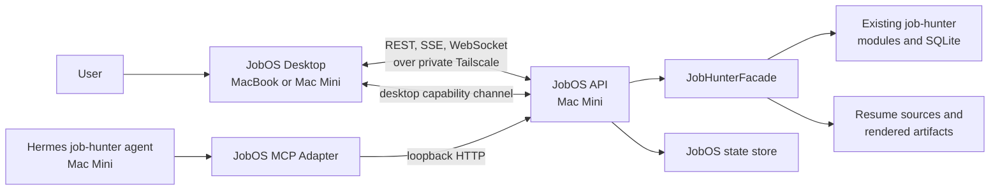
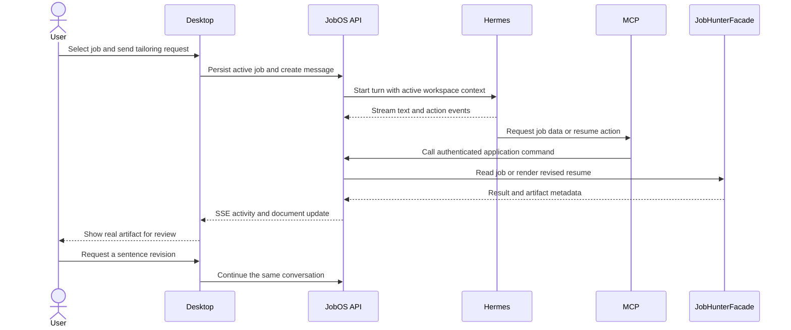
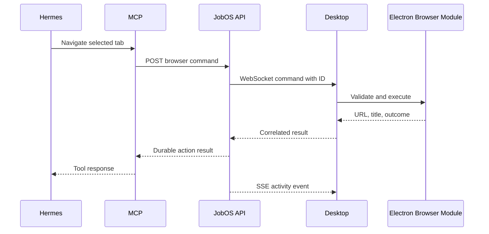

# JobOS V1 Technical Architecture

## Status

Proposed implementation architecture for the locked V1 workbench contract.

This document chooses the major technical boundaries required to build V1. It is subordinate to the [`V1 Workbench Contract`](../planning/specs/v1-workbench-contract.md): when an implementation shortcut would weaken continuity, browser freedom, artifact fidelity, layout adaptability, or human-agent parity, the product contract wins.

## Verified Starting Point

As verified on July 19, 2026, the current GitHub source of truth for the job-hunter system is `cobibean/job-hunter-agent-workspace` at commit `5b07bbaa`, not the older local clones on this MacBook. The repository is a Python 3.11 CLI application with SQLite-backed job and lead storage, the full lead-state vocabulary, and an existing Markdown-to-PDF resume pipeline.

The authoritative runtime and working data live on the user's Mac Mini. The Mini is online over the user's private Tailscale network, but this MacBook does not currently have working SSH credentials for it. Consequently, the exact live checkout path, Hermes integration surface, process manager, and MCP transport are intentionally treated as Phase 0 verification items rather than assumptions.

## Architecture Goals

V1 architecture must make these product truths easy to preserve:

- The app reopens into the workbench exactly as the user left it.
- The browser behaves like a real persistent browser, not a job-bound web preview.
- One continuous Hermes conversation can move among jobs without being recreated.
- The user and agent act on the same jobs, statuses, documents, and workspace state.
- Agent actions are visible as concise chronological events.
- Resume preview shows the real rendered artifact.
- Existing job-hunter data and domain behavior are reused, not reimplemented.
- No public internet exposure is required for the Mini-side control plane.

## System Context



The Mac Mini is the server-side source of truth. The desktop app is the human workbench and the only owner of interactive browser sessions. Hermes uses MCP, but MCP never bypasses the application API.

## Chosen Stack

Versions below are the July 19, 2026 implementation baseline. Scaffold work must recheck supported releases and pin exact versions rather than using unbounded ranges.

### Desktop application

- Electron, pinned to the supported stable major at scaffold time
- React 19.2 and TypeScript
- Vite 8.1
- pnpm workspace tooling
- Lucide as the single UI icon family, with a deliberately limited mature monochrome subset

Electron is the appropriate V1 choice because the product needs a real embedded browser with durable sessions and programmatic tab control. Browser surfaces are owned by the Electron main process using `WebContentsView`; React renders the workbench chrome, job navigator, document workspace, and chat.

### Mini-side services

- Python 3.11
- FastAPI, pinned to an exact verified release at scaffold time
- SQLite for JobOS-owned durable state
- Official Python MCP SDK
- `uv` for Python dependency and environment management

Python keeps the API beside the existing job-hunter domain and rendering code. It avoids a second implementation of job state transitions, resume generation, or SQLite access in TypeScript.

### Transport roles

| Transport | Purpose | Why |
|---|---|---|
| REST/JSON | Queries and durable commands | Simple, inspectable, idempotent where needed |
| Server-Sent Events | Chat tokens and chronological activity events | One-way streaming with reconnection and event IDs |
| WebSocket | Desktop capability channel | Browser commands and results must flow both ways |
| MCP over local stdio initially | Hermes tool access | Smallest local trust boundary when agent and API share the Mini |

If Phase 0 shows Hermes requires a network MCP transport, the same MCP Adapter may expose Streamable HTTP over loopback or private Tailscale. The tools and application API remain unchanged.

## Repository Shape

```text
job-os/
├── apps/
│   └── desktop/
│       └── src/
│           ├── main/          # windows, WebContentsView, sessions, capability client
│           ├── preload/       # narrow typed renderer bridge
│           └── renderer/      # React workbench UI
├── services/
│   ├── api/
│   │   └── jobos_api/
│   │       ├── modules/       # jobs, workspace, chat, documents, activity
│   │       ├── adapters/      # job-hunter, Hermes, persistence
│   │       └── transport/     # HTTP, SSE, WebSocket
│   └── mcp/
│       └── jobos_mcp/         # thin tools over the JobOS API
├── packages/
│   └── contracts/             # generated TypeScript API types/client
└── docs/
```

The existing job-hunter repository remains independent. A small reviewed change there adds its public Facade; JobOS consumes that package or checkout through an Adapter. JobOS does not vendor or fork the job-hunter domain.

## Deep Modules and Interfaces

### JobHunterFacade Module

This is the primary Seam with the existing job-hunter system. It must be a small, stable Interface over substantial existing behavior.

Initial Interface:

- `list_jobs(filters, sort)`
- `get_job(job_id)`
- `update_lead_state(job_id, target_state, origin, reason)`
- `get_lead_history(job_id)`
- `list_job_artifacts(job_id)`
- `render_resume(job_id, source_id, output_options)`
- `register_artifact(job_id, artifact)`

Its Implementation calls the existing `JobStorage`, lead transition logic, and resume rendering pipeline. It owns translation from job-hunter records into application contracts. No JobOS Module may issue raw SQL against job-hunter tables.

The artifact manifest contract is order-independent. Every item returned by
`list_job_artifacts(job_id)` carries a unique, non-negative `render_sequence`;
the highest sequence is current, and the highest successful sequence is the
last successful artifact. List position is never used to infer either pointer.

This creates Depth: the Interface stays small while it hides storage schema, state-transition rules, render manifests, and filesystem conventions. It also improves Locality by keeping changes to those rules in the job-hunter repository.

### Workspace Module

Owns selected job, active center surface, layout preset, panel order, widths, collapsed state, browser-tab metadata, active document, and restoration checkpoints.

Its Interface exposes atomic workspace snapshots and commands rather than independent settings writes. That prevents partially restored layouts and gives one coherent persistence boundary.

### Browser Capability Module

The Electron main process owns live browser instances and exposes a bounded Interface:

- list, create, select, reorder, and close tabs
- navigate, back, forward, reload, and stop
- read current URL, title, loading state, and navigation result
- click, type, scroll, and capture a bounded snapshot for agent actions
- associate or disassociate a tab with a job without changing the tab's session

Arbitrary remote JavaScript execution is not part of the default Interface. New capabilities should be added intentionally with validation and audit semantics.

The API sends browser commands through a WebSocket to the connected desktop and correlates each result with a command ID. If no capable desktop is connected, the command fails clearly; it is not silently queued against a browser that may no longer exist.

### AgentGateway Module

The API depends on a small Interface for starting a Hermes turn, streaming progress, cancelling a turn, and recovering conversation identity. A Hermes Adapter supplies the live Implementation after Phase 0 verifies the actual runtime contract.

The API, not the renderer, owns the durable transcript and normalized activity stream. This lets a reopened desktop recover a single continuous conversation and lets agent tool calls appear in the same chronology as text.

### Document Module

The API exposes documents by opaque artifact ID. The registry records job association, source revision, rendered revision, media type, hash, render status, and last successful artifact. The desktop never asks the API to open an arbitrary filesystem path.

PDF is the primary preview contract. DOCX may be opened externally or downloaded in V1, but it is not silently rendered with lower fidelity and presented as authoritative.

### MCP Adapter

MCP is an Adapter, not a second backend. Every MCP tool authenticates, validates input, calls the same HTTP application Interface as the desktop, and returns the API result.

Initial tool families:

- jobs: list, inspect, select, reorder, update status
- workspace: inspect and choose the active surface or layout
- browser: inspect tabs, navigate, and perform bounded interactions
- documents: list, render, register, and select artifacts
- activity: report an agent action with expandable details

This produces Leverage: one API command adds both human and agent capability without implementing two sets of rules.

## State Ownership

| State | Authority | Notes |
|---|---|---|
| Jobs, lead status, history, scoring | Existing job-hunter SQLite | Accessed only through `JobHunterFacade` |
| Resume sources, render outputs, manifests | Existing job-hunter workspace | Registered in JobOS by opaque artifact ID |
| Chat transcript and agent activity | JobOS SQLite | Append-oriented, ordered, recoverable |
| Layout, selection, panel state, tab metadata | JobOS SQLite | Scoped by user and desktop device where appropriate |
| Browser cookies, cache, login sessions | Electron persistent session partition | Never copied to the API or Mini |
| Live browser views and navigation stack | Electron main process | Metadata is durable; live views are reconstructed |
| Connected desktop capability presence | JobOS API memory plus short-lived lease | Never treated as durable truth |

V1 does not migrate existing job-hunter data into `jobos.db`. The split is deliberate: domain records stay authoritative where they already live, while new workbench state gets a schema designed for restoration and event history.

## Core Flows

### Resume-tailoring golden path



### Agent-driven browser action



## API Shape

The OpenAPI description is the contract source for the generated desktop client. Representative resources:

- `/v1/jobs` and `/v1/jobs/{id}`
- `/v1/jobs/{id}/status`
- `/v1/jobs/{id}/artifacts`
- `/v1/workspace`
- `/v1/layout-presets`
- `/v1/conversations/current/messages`
- `/v1/events/stream`
- `/v1/desktop/capabilities`
- `/v1/browser/commands`

Every durable mutation accepts an idempotency key and records:

- user, agent, or system origin
- actor identity
- timestamp
- target resource
- command name and outcome
- safe structured detail without credentials or document content by default

MCP tool schemas are generated or tested against these same application contracts to prevent drift.

## Desktop Process Boundaries

### Main process

Owns windows, `WebContentsView` instances, browser sessions, downloads, permission decisions, native file opening, Keychain-backed credentials, and the capability WebSocket.

### Preload

Exposes a narrow typed bridge for approved operations. It does not expose raw IPC, Electron objects, filesystem access, or generic command execution.

### Renderer

Owns presentation and transient interaction state. It communicates through the generated API client and preload bridge. It cannot directly manipulate remote browser contents or local files.

Browser view bounds are synchronized from renderer layout geometry to the main process. Changing layout updates bounds; it must not recreate the underlying `WebContentsView` or session.

## Security and Trust Boundaries

- The JobOS API binds to loopback or the private Tailscale interface only. It is not a public web service.
- Each desktop uses a revocable device credential stored in macOS Keychain. Hermes uses a separate loopback-scoped service credential.
- Remote browser content runs with Node integration disabled, context isolation enabled, sandboxing enabled, and no access to JobOS preload APIs.
- Navigation is limited to `http` and `https` unless an explicit native handler is approved.
- New-window requests, downloads, media permissions, notifications, clipboard access, and external-protocol launches have explicit policies.
- IPC senders and browser command inputs are validated at their trust boundary.
- Cookies and browser authentication material remain in the Electron profile on the desktop.
- Document access is allowlisted through registered artifact IDs and resolved canonical paths.
- Tool details are useful when expanded but redact secrets, tokens, cookies, headers, and environment values.
- Consequential external actions such as submitting an application retain an explicit human approval boundary.

## Failure and Recovery Model

- The desktop writes workspace changes as atomic snapshots with monotonic revisions.
- SSE clients resume from the last event ID; transcript retrieval fills any gap.
- Browser tab metadata is restored even when an individual page cannot reload.
- Browser commands fail with `desktop_unavailable`, `tab_not_found`, `navigation_blocked`, or a bounded execution error.
- A failed resume render preserves and clearly labels the last successful artifact.
- If Hermes is offline, the user can still inspect jobs, browse, preview documents, and change statuses.
- If the API is unreachable, the desktop keeps browser sessions alive and presents reconnection state without pretending writes succeeded.

## Testing Strategy

- Python unit tests for Facade translation, application commands, permissions, idempotency, and event ordering
- API integration tests against disposable SQLite databases and fixture artifacts
- MCP contract tests proving every tool uses the API and matches its schemas
- React component tests for dense navigation, activity disclosure, and accessibility
- Electron integration tests for view geometry, persistent partitions, tab restoration, and blocked permissions
- End-to-end tests for the golden path plus explicit human checks for Gmail/general browsing, resume fidelity, resizing, and packaged-app behavior

Passing code tests is necessary but not sufficient. Each phase in the implementation plan ends with observable product proof.

## Architecture Decisions

### Electron instead of a web shell, Tauri, or native SwiftUI

The embedded browser is a core product surface. Electron provides a first-class Chromium content view, persistent sessions, navigation control, and a mature desktop packaging path. A remote web app cannot safely provide this browser control, and adopting a less direct webview stack would add risk to the V1 differentiator.

### API on the Mac Mini instead of duplicating data locally

The job-hunter agent, authoritative repository, SQLite data, and resume workspace already live on the Mini. Keeping the control plane there eliminates sync conflict and makes user-agent parity real rather than eventual.

### Python API instead of a Node API

The existing domain and artifact pipeline are Python. A Python API creates a clean Seam around that code; Node would require a subprocess bridge or duplicated domain rules.

### Thin MCP Adapter instead of direct database or filesystem tools

Direct tools would create a privileged second backend with different validation, history, and permissions. API-only MCP ensures both actors use the same commands and audit trail.

### Split persistence instead of expanding the existing job-hunter schema

Job-hunter remains authoritative for job-search domain data. JobOS owns workbench and conversation state. This preserves Locality and avoids coupling the CLI's storage model to every desktop concern.

### SSE plus WebSocket instead of polling alone

Chat and activity are server-to-client streams suited to SSE. Browser automation is bidirectional and requires correlated command results, so it uses a dedicated WebSocket capability channel.

## Phase 0 Facts Still Requiring Live Verification

Before implementation begins, verify on the Mac Mini:

1. The authoritative checkout path, active branch, commit, Python environment, and writable data locations.
2. How Hermes accepts a chat turn, emits token or activity events, persists conversation identity, and handles cancellation.
3. Whether Hermes supports local stdio MCP and how its tool configuration is loaded and restarted.
4. The service manager and lifecycle expectations for the API and MCP processes.
5. Whether the desktop will usually run on the MacBook, the Mini, or both, and the expected Tailscale identity policy.
6. Real artifact paths and the current render pipeline's dependencies on the Mini.

No Phase 0 result should silently change the product contract. If the runtime cannot support a chosen Adapter, replace that Implementation behind the same Interface.

## V1 Architectural Non-Goals

- Public cloud control plane
- Multi-user tenancy or team permissions
- Replacing job-hunter storage or state vocabulary
- Browser credential synchronization between machines
- Generic arbitrary-code browser automation
- A second agent framework inside JobOS
- Built-in document editing
- Automatic application submission
- Plugin marketplace or general-purpose desktop shell

## Primary Technical References

- [Electron `WebContentsView`](https://www.electronjs.org/docs/latest/api/web-contents-view)
- [Electron session partitions](https://www.electronjs.org/docs/latest/api/session)
- [Electron security guidance](https://www.electronjs.org/docs/latest/tutorial/security)
- [React versions](https://react.dev/versions)
- [Vite release policy and current lines](https://vite.dev/releases)
- [FastAPI Server-Sent Events](https://fastapi.tiangolo.com/tutorial/server-sent-events/)
- [Official MCP Python SDK](https://modelcontextprotocol.github.io/python-sdk/)
- [MCP Python server transports](https://modelcontextprotocol.github.io/python-sdk/server/)
- [Lucide icon system](https://lucide.dev/)

## Definition of Architecture Success

The architecture succeeds when the seven-step golden path runs against real Mini-side job-hunter data, the browser remains a durable independent workspace, the same application commands serve user and agent, and every important action can be understood and recovered without exposing the user's credentials or corrupting the existing job-search system.
