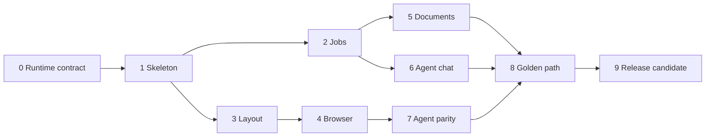

# JobOS V1 Implementation Plan

## Status

Proposed delivery plan for the locked V1 product contract and technical architecture.

## Governing Sources

- [`V1 Workbench Contract`](../specs/v1-workbench-contract.md)
- [`V1 Technical Architecture`](../../architecture/v1-technical-architecture.md)
- [`Locked Visual Direction`](../../design/references/jobos-v1-locked-direction.png)

The golden path is the release unit. A phase is complete only after its user-visible proof passes; a build or test suite alone does not close a phase.

## Delivery Rules

- GitHub's current `cobibean/job-hunter-agent-workspace` main branch is the source baseline for integration planning.
- The authoritative live runtime remains the Mac Mini and must be inspected before implementation.
- Existing job-hunter data is not migrated, rewritten, or bulk-modified during scaffolding.
- Changes to the job-hunter repository use a separate reviewed branch and are limited to the public Facade and tests needed by JobOS.
- MCP never reads job-hunter SQLite or files directly; it calls the JobOS API.
- Every phase keeps the app launchable and produces a narrow vertical slice.
- Exact dependency versions are pinned when scaffolding begins and updated intentionally.

## Phase 0 — Live Runtime Contract Spike

### Outcome

Replace the remaining Mac Mini and Hermes assumptions with a short, verified runtime contract.

### Work

- Restore SSH access from the development MacBook to the Mini over private Tailscale.
- Confirm the authoritative checkout, branch, commit, Python version, environment manager, data paths, artifact paths, and writable boundaries.
- Inspect the running Hermes job-hunter profile and determine how to start a turn, stream output, recover conversation identity, cancel work, and configure MCP.
- Confirm whether local stdio MCP is supported; record the fallback transport only if necessary.
- Identify the service manager, restart workflow, log locations, and safe development instance strategy.
- Run read-only smoke checks against real jobs and one existing resume artifact.
- Record credentials and secrets only by name and storage mechanism, never by value.

### Verification gate: Runtime Contract

- A concise runtime inventory is committed to project documentation.
- The GitHub checkout and Mini checkout are reconciled.
- One read-only job query and one existing artifact lookup succeed on the Mini.
- A disposable Hermes turn proves the actual message and event interface without modifying job-search data.
- The chosen MCP transport is demonstrated.

Implementation does not proceed past this gate if the live topology differs materially from the architecture.

## Phase 1 — Application Skeleton and Contracts

### Outcome

A desktop shell opens in the locked visual direction and reaches a healthy Mini-side API over the private network.

### Work

- Create the pnpm and `uv` workspace structure defined in the architecture.
- Pin Electron, React, Vite, FastAPI, MCP SDK, and test dependencies to verified stable releases.
- Scaffold Electron main, preload, and renderer boundaries with sandboxing and context isolation enabled.
- Scaffold FastAPI health, version, device authentication, and OpenAPI endpoints.
- Generate the TypeScript API client from OpenAPI.
- Establish JobOS SQLite migrations and disposable test databases.
- Implement the dark workbench frame, global workspace bar, empty panels, typography, spacing tokens, and mature Lucide icon subset.
- Add CI for typecheck, lint, Python tests, renderer tests, build, and contract generation drift.

### Verification gate: Connected Shell

- The desktop launches on macOS and matches the locked composition at the reference viewport.
- It authenticates to the Mini over Tailscale and displays API connectivity accurately.
- Renderer code cannot access raw Electron IPC, Node APIs, or the filesystem.
- CI passes from a clean checkout.

## Phase 2 — Real Jobs and Shared Status

### Outcome

The navigator shows real jobs from the existing system, and user and agent status changes use one durable command.

### Work

- Add and test `JobHunterFacade` in a reviewed job-hunter branch.
- Implement list, inspect, lead history, and state-transition operations through existing domain behavior.
- Build the JobOS Adapter and normalized API contracts.
- Map the existing detailed states into the six UI groups without altering stored vocabulary:
  - Inbox
  - Considering
  - Applied
  - Interviewing
  - Closed
  - Inactive
- Implement compact job rows, selection, filtering, grouped status display, sort by recent/alphabetical/status, and manual order.
- Preserve manual order independently of current sort mode.
- Record mutation origin and expose updates through the event stream.
- Add MCP tools for job list, inspect, select, reorder, and update status.

### Verification gate: Shared Jobs

- Real Mini-side jobs render correctly in the navigator.
- Every existing underlying status is represented in exactly one UI group.
- A user status change is visible through MCP immediately.
- An agent status change appears in the UI without refresh or reconciliation.
- Invalid transitions produce clear errors and no partial history.

## Phase 3 — Persistent Workbench Layout

### Outcome

The workbench feels physically adaptable and returns exactly as the user left it.

### Work

- Implement Research, Review, and Agent Focus presets.
- Add continuous pointer resizing with usable minimums.
- Add keyboard-accessible resizing and collapsing.
- Add intentional panel reordering with insertion previews.
- Persist order, widths, collapsed state, selected preset, selected job, and active center surface.
- Implement Reset Layout for the active preset without touching content state.
- Save workspace snapshots atomically with revision conflict handling.
- Reconcile local geometry with the server snapshot during startup.

### Verification gate: Continuity

- Resize, collapse, reorder, switch presets, and reset all behave as specified.
- Browser/chat/document placeholders are not recreated by layout changes.
- Quit and relaunch restores a coherent snapshot on the same device.
- A corrupted or incompatible panel value falls back locally without resetting jobs, chat, or browser metadata.

## Phase 4 — Real Persistent Browser

### Outcome

The center surface is a genuine browser that survives job changes, layout changes, and app restarts.

### Work

- Implement tab creation, selection, closing, reordering, and restoration with Electron `WebContentsView`.
- Use a persistent Electron session partition for cookies, cache, and logins.
- Implement address bar, navigation controls, loading feedback, titles, favicons, downloads, and restrained error states.
- Keep live browser views owned by the main process and synchronize bounds from the renderer.
- Allow optional job-tab association without navigating, closing, or resetting unrelated tabs.
- Enforce permission, popup, new-window, external-protocol, and download policies.
- Persist tab metadata to the Workspace Module without persisting credentials.
- Add manual and automated recovery cases for crashed or unavailable pages.

### Verification gate: Browser Freedom

- The user can use Google, Gmail, and a real job listing as normal browser sessions.
- Switching among jobs never closes or navigates an unrelated tab.
- Resizing, collapsing, and preset changes do not reload the active page.
- Quit and relaunch restores tabs and authenticated session continuity where the site permits it.
- Remote content has no Node, preload, or raw IPC access.

This phase requires a visible human check on both the MacBook and Mini if both are intended desktop hosts.

## Phase 5 — Trusted Document Workspace

### Outcome

The user can inspect the actual resume artifact the agent produced and recover safely from render failures.

### Work

- Implement the document registry and opaque artifact IDs.
- Reuse existing job-hunter render and manifest behavior through `JobHunterFacade`.
- Stream allowlisted PDFs with correct media type, hash, and revision metadata.
- Build PDF preview, zoom, page navigation, refresh, download, reveal/open externally, and job association.
- Show source revision, artifact revision, generation status, and last successful render.
- Preserve the last successful artifact when a new render fails.
- Treat DOCX as external-open/download unless a fidelity-verified preview path is approved.

### Verification gate: Artifact Trust

- A real existing resume renders in JobOS identically to the exported PDF.
- A new tailored artifact appears without manual file browsing.
- A forced render failure leaves the last good preview intact and clearly labels the failure.
- Arbitrary filesystem paths and traversal attempts cannot be opened through the API.

## Phase 6 — Continuous Agent Chat and Activity

### Outcome

The user can talk to the existing Hermes agent in one continuous conversation and watch meaningful work unfold.

### Work

- Implement the Phase 0 Hermes Adapter behind `AgentGateway`.
- Persist one current conversation, messages, turn state, and cancellation state.
- Include selected job and active workspace context in each turn without creating per-job conversations.
- Normalize text deltas, tool starts, tool completions, file changes, render events, errors, and final responses.
- Stream them over SSE with event IDs and reconnection.
- Build collapsed one-line activity rows with accessible expansion for safe command/file/detail fields.
- Add stop, retry, reconnect, and offline states.
- Redact secrets and large raw output before persistence or display.

### Verification gate: Observable Agent

- A user message reaches the real Hermes agent and streams back into JobOS.
- Fifteen sequential tool calls appear as fifteen ordered, concise events.
- Expanding an event shows useful safe detail; collapsing it preserves chronology.
- Relaunching restores the conversation and final activity state.
- Switching jobs changes context for the next turn without changing conversations.

## Phase 7 — Agent Parity and Browser Capability Channel

### Outcome

The agent can perform the same bounded workbench actions as the user through MCP, including visible browser actions.

### Work

- Complete the thin MCP Adapter for jobs, workspace, documents, browser, and activity.
- Connect authenticated desktops to the API capability WebSocket with short-lived presence leases.
- Implement correlated browser commands for tabs, navigation, click, type, scroll, and bounded snapshots.
- Validate every browser command in the Electron main process.
- Surface each agent-initiated action in the activity chronology with origin and outcome.
- Add idempotency and timeouts so retries do not duplicate durable mutations.
- Provide explicit `desktop_unavailable` and `tab_not_found` recovery guidance.
- Add a parity matrix showing the API command behind every shared user/agent action.

### Verification gate: Anything-I-Can-Do Parity

The real agent can, through MCP only:

1. inspect and select a job;
2. change its status;
3. inspect and navigate browser tabs;
4. open the job listing in the active browser;
5. start a resume render;
6. register and select the resulting artifact; and
7. produce visible activity events for each action.

The same commands are exercised from the UI, and their durable results match.

## Phase 8 — V1 Golden Path

### Outcome

The complete resume-tailoring journey works as one calm, coherent workflow against real data.

### Work

- Connect selected job, browser listing, conversation context, resume source, render output, and document preview.
- Let Hermes create or revise a tailored source using its existing workspace tools.
- Automatically register successful artifacts and focus the latest result without stealing browser session state.
- Support feedback in chat, another render, version comparison metadata, and explicit approval/save-to-job.
- Polish progress, success, error, empty, and restoration states across the whole journey.
- Match density, hierarchy, interaction tone, and icon restraint to the locked visual direction.

### Verification gate: Golden Path

Starting with ten real jobs, the user can:

1. select a job;
2. inspect its live listing;
3. ask for a tailored resume;
4. observe meaningful agent actions;
5. inspect the real rendered result;
6. request and see a revision; and
7. save the approved artifact to the job.

The journey must survive one deliberate desktop restart and one recoverable agent or render failure without losing trusted state.

## Phase 9 — Hardening and Packaged Release Candidate

### Outcome

V1 is safe and dependable enough for daily use on the user's actual Macs.

### Work

- Complete keyboard navigation, resize/reorder alternatives, focus management, accessible names, contrast, and activity announcements.
- Test API loss, Hermes loss, Mini restart, desktop sleep/wake, Tailscale reconnection, browser crash, and stale workspace revisions.
- Audit Electron permissions, IPC validation, navigation, downloads, external protocols, credential storage, log redaction, and artifact path handling.
- Add database backup and migration rollback procedures for JobOS-owned state.
- Package, sign, and notarize the macOS app.
- Define safe Mini service install, upgrade, restart, and rollback commands.
- Add diagnostics that reveal connectivity and component health without exposing secrets.
- Run the full automated suite from clean environments and the human acceptance checklist on real hardware.

### Verification gate: Release Candidate

- A packaged app passes the golden path on every intended Mac.
- Restart and network-recovery drills preserve coherent state.
- Security review finds no route from remote browser content to Node, raw IPC, filesystem, or API credentials.
- The user explicitly accepts browser feel, layout feel, document fidelity, and agent observability.
- Installation and rollback are documented and rehearsed.

## Cross-Phase Test Matrix

| Layer | Automated proof | Human proof |
|---|---|---|
| Job-hunter integration | `pytest` Facade and transition tests | Real job/history spot check |
| JobOS API | Unit, integration, migration, auth, idempotency | Connectivity and failure clarity |
| MCP | Schema and API parity contract tests | Real Hermes tool run |
| Renderer | Component, state, and accessibility tests | Density, hierarchy, keyboard feel |
| Electron main | Browser session, IPC, permission, restoration tests | Gmail/general browsing and resizing |
| Documents | Hash, revision, allowlist, failed-render tests | PDF fidelity comparison |
| End to end | Electron golden-path automation where stable | Full seven-step acceptance journey |

## Dependency Order

Phases 2 and 3 may proceed in parallel after the connected shell. Documents and agent chat may also overlap after their dependencies are stable. The proof gates, not calendar estimates, determine readiness.

## Scope Guardrails

Do not add these before the golden path passes:

- dashboard, analytics, morning briefing, or Kanban view
- built-in resume editor
- separate conversations per job
- a replacement job-status model
- arbitrary dashboard composition
- generic CRM or application autofill platform
- public cloud deployment
- multi-user support
- auto-submit without explicit approval
- broad browser scripting APIs added only for theoretical future use

## First Implementation Decision

The first implementation action is not scaffolding Electron. It is restoring read-only Mac Mini access and closing Phase 0. That small gate protects the entire architecture from being built around another stale checkout or an imagined Hermes interface.
